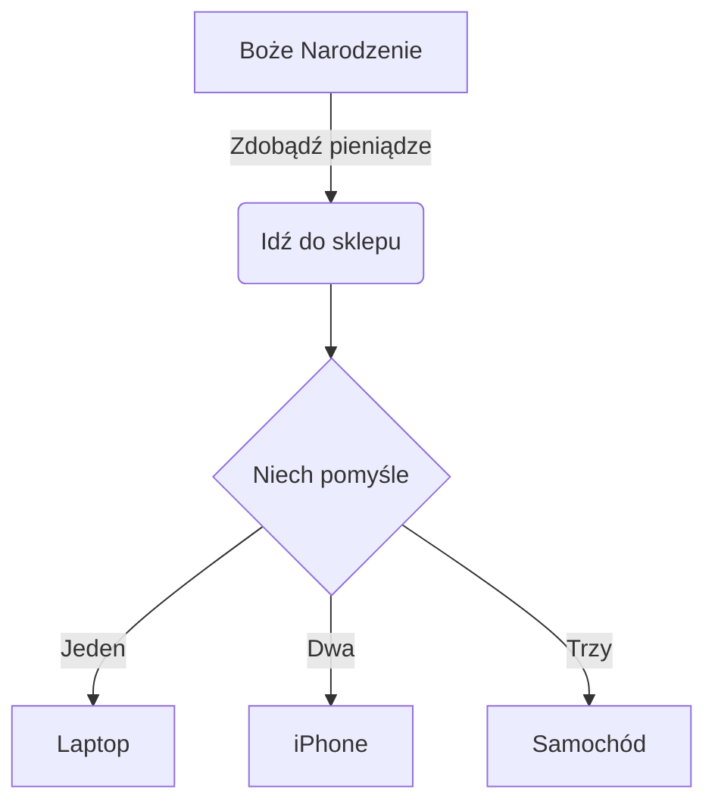

---
	METADANA niewidoczna część notatki w Obsidian
---

# Markdown / Obsidian - składnia

^08d127

___
## Nagłówki

^28faf9

# h1 Nagłówek
## h2 Nagłówek
### h3 Nagłówek
#### h4 Nagłówek
##### h5 Nagłówek
###### h6 Nagłówek

h1 Nagłówek
===============
h2 Nagłówek
---------------


## Podział - kreska
___
---
***


## Podział wierszy i akapitów
Wiersz 1 -> Dwie spacje + Enter ->  
Wiersz 2

Wiersz 1 -> znacznik HTML "br" -> <br>
Wiersz 2

Akapit 1 -> Enter + Enter -> ^076639

Akapit 2


## Formatowanie

**Pogrubiony tekst** -> w środku zdania ^a9b1d7

__Pogrubiony tekst__

*Kursywa*  -> w środku zdania

_Kursywa_ ^5aeb6a

***Pogrubiona kursywa*** -> w środku zdania

~~Przekreślenie~~

==Zaznaczony tekst==

Niwelacja działania znaków specjalnych poprzez znak \\ - działa na: \\ \` * _ {} [] <> () # + - . ! |   
\- Ze znakiem \\
- Bez znaku \\

-> Do formatowania można również używać znaczników **HTML**


## Cytaty blokowe

> Cytaty blokowe można zagnieżdżać ...
>> ... używając dodatkowych znaków większości bezpośrednio obok siebie ...
> > > ... lub ze spacjami między strzałkami, ... <br>   
>>> ... a także łamać wiersza dwoma spacjami lub znacznikiem "br", ...
>>
>> ... żeby opuścić zagnieżdżenie należy użyć tej samej ilości znaków większości + Enter ... 
> 
> ... dziwne co nie.


## Listy

Utwórz listę nieuporządkowaną, zaczynając linię od `+`, `-` lub` * `
+ plus
- minus
* gwiazdka

Utwórz listę uporządkowaną, zaczynając linię od 1. 2. 3.  ^51b07c

1.  Pierwsza pozycja
2.  Druga pozycja
3.  Trzecia pozycja

Utwórz listę uporządkowaną, zaczynając linię od 1. 1. 1.
1.  Pierwsza pozycja
1.  Druga pozycja
1.  Trzecia pozycja

Utwórz listę uporządkowaną, zaczynając linię - licząc od 100. 1. 1. 2. 3 itp.

100. foo
1.  Pierwsza pozycja
1.  Druga pozycja
2.  Trzecia pozycja

Utwórz listę zagnieżdżoną -> Enter + Tab
1.  Pierwsza pozycja
	-  Podpunkt jeden
	-  Podpunkt dwa
2.  Druga pozycja
	1.  Podpunkt jeden
	2.  Podpunkt dwa

Rozpoczynanie nieuporządkowanych elementów listy z numerami -> \\
- 2020\.
- 2021

Utwórz listę To-do -> - [ ]
- [ ] Zadanie 1
- [x] Zadanie 2
- [ ] Zadanie 3

## Bloki kodu

Kod nieoznaczony -> `kod`

Kod z wcięciem -> Enter + Tab

	Kilka komentarzy
    linia 1 kodu
    linia 2 kodu
    linia 3 kodu


Nieoznaczony kod z ogrodzeniem ->  \```kod```

```
Przykładowy tekst tutaj...
```

Podświetlanie składni języka programowania -> \``` nazwa języka -> Enter -> kod -> Enter```

``` js
var foo = function (bar) {
  pasek powrotu ++;
};

console.log (foo (5));
```


## Tabele

| Opcja | Opis |
| ------ | ----------- |
| dane | ścieżka do plików danych w celu dostarczenia danych, które zostaną przekazane do szablonów. |
| silnik | silnik do przetwarzania szablonów. Kierownica jest ustawieniem domyślnym. |
| ext | rozszerzenie, które ma być używane dla plików dest. |

Kolumny wyrównane do prawej

| Opcja | Opis |
| ------: | -----------: |
| dane | ścieżka do plików danych w celu dostarczenia danych, które zostaną przekazane do szablonów. |
| silnik | silnik do przetwarzania szablonów. Kierownica jest ustawieniem domyślnym. |
| ext | rozszerzenie, które ma być używane dla plików dest. |


## Linki

-> [Tekst linku](http://dev.nodeca.com)

-> [Link z tytułem](http://nodeca.github.io/pica/demo/ "Tekst tytułu!")

Link z automatyczną konwersią -> https://github.com/nodeca/pica

Linki wewnętrzne -> [[🏡Dom]] + Linki zwrotne

Linki do nagłówków -> [[📝Markdown_Notatka#Markdown składnia]]

Link do bloku -> [[#^08d127]]

Linki nagłówkowe / blokowe o innej nazwie -> [[📝Markdown_Notatka#^08d127|Tekst]]

Hasztag -> #Hasztag 

Hasztagi zagnieżdżone -> #Hasztag/Hasztag

Lista hasztagów
```query
tag: #Hasztag 
```


## Obrazy

| Obraz |Obraz z tytułem | Obraz z linkiem do obrazu i tytułem w przypisie  |Obraz z linkiem wysyłającym do źródła i tytułem|
| ----- | ----- | ----- | ----- |


![Obraz3][id]
[](https://www.youtube.com/  "Tekst tytułu!")

[id]: https://picsum.photos/seed/picsum/150  "Tekst tytułu!"

Zmiana wielkości obrazu


## Filmy

W znacznikach HTML "iframe"
<iframe width="560" height="315" src="https://www.youtube.com/embed/wKNWMBeGCuU" title="YouTube video player" frameborder="0" allow="accelerometer; autoplay; clipboard-write; encrypted-media; gyroscope; picture-in-picture" allowfullscreen></iframe>


## Przypisy w Obsidian

Przypis 1 link[^1].

Przypis 2 link[^2].

Powielone odniesienie do przypisu[^2].

Przypis wewnętrzny^[Tekst wbudowanego przypisu] definicja.

[^1]: Notka **może mieć znaczniki**

	i wiele akapitów.

[^2]: Tekst przypisu 2.


## Szablony
Automatyczne zastępowanie przy wywołaniu szablonu  
{{title}} - tytuł notatki  
{{date:DD-MM-YYYY}} - bieżąca data  
{{date:D MMM, YYYY}} - bieżąca data


## Diagramy i wykresy
[Link do strony z diagramami i  waykresami](https://mermaid-js.github.io/mermaid-live-editor/#/edit/eyJjb2RlIjoiZ3JhcGggVERcbiAgICBBW0NocmlzdG1hc10gLS0-fEdldCBtb25leXwgQihHbyBzaG9wcGluZylcbiAgICBCIC0tPiBDe0xldCBtZSB0aGlua31cbiAgICBDIC0tPnxPbmV8IERbTGFwdG9wXVxuICAgIEMgLS0-fFR3b3wgRVtpUGhvbmVdXG4gICAgQyAtLT58VGhyZWV8IEZbZmE6ZmEtY2FyIENhcl0iLCJtZXJtYWlkIjp7InRoZW1lIjoiZGVmYXVsdCJ9LCJ1cGRhdGVFZGl0b3IiOmZhbHNlfQ)




## WWW na .MD
[Wtyczka WWW na .MD](https://chrome.google.com/webstore/detail/markdownload-markdown-web/pcmpcfapbekmbjjkdalcgopdkipoggdi?utm_source=chrome-ntp-icon)
